# Advanced-Visualizations

 - Advanced Visualizations via ggplot2:
Adjust legends, fonts, orientation, and math expressions to fine-tune your plots
Create high-quality graphics with ggplot2's advanced features
Improve the readability and aesthetic appeal of your visualizations

 - Visualizing Networks as Graphs:
Represent nodes and edges with colors, shapes, and labels
Arrange nodes and edges in different structures, such as circular, hierarchical, or force-directed layouts
Add interactivity to highlight, select, and display additional information on mouseover or click
 
 - Interactive Visualization:
Choose a suitable software or package, such as Shiny, Bokeh, Plotly, or D3.js
Add widgets, such as sliders, buttons, menus, or checkboxes, to allow user interaction with your visualizations
Create engaging and exploratory visualizations that can enhance data communication and understanding
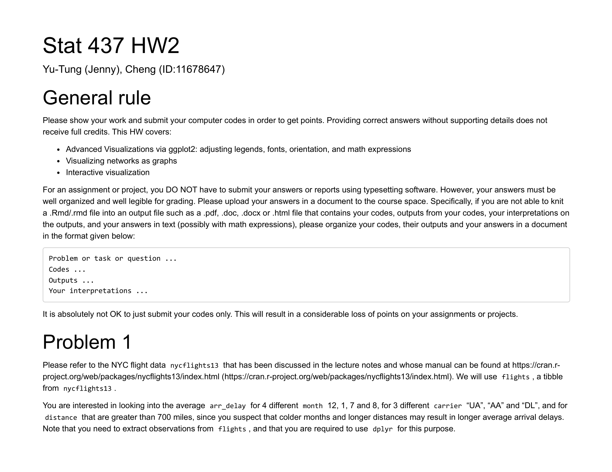
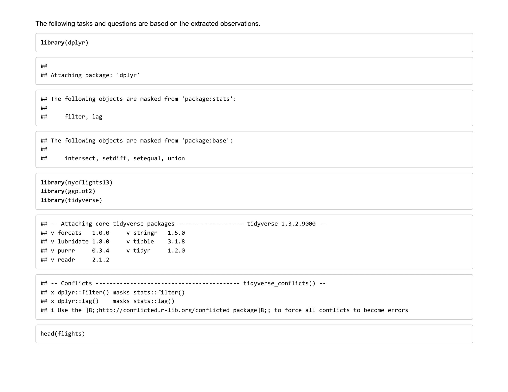
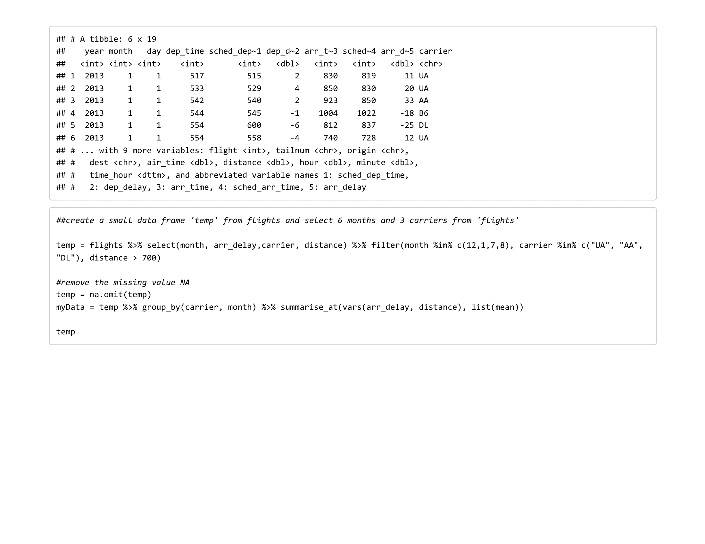
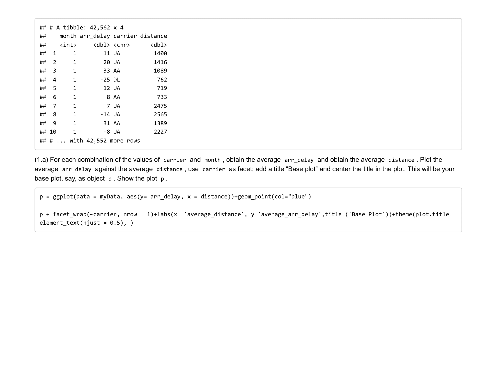
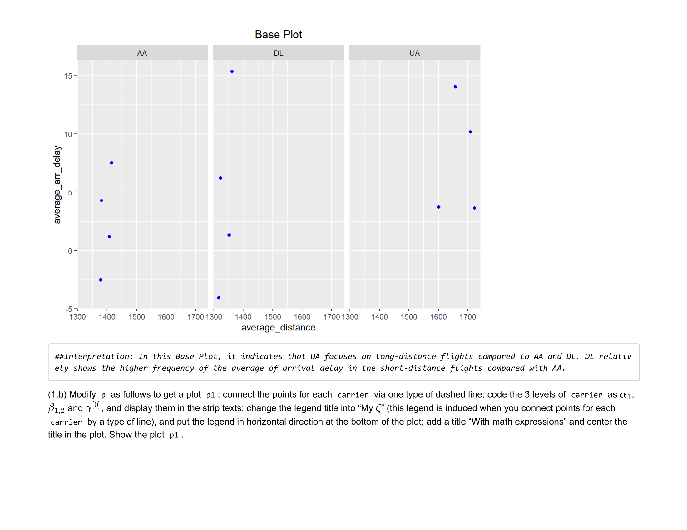
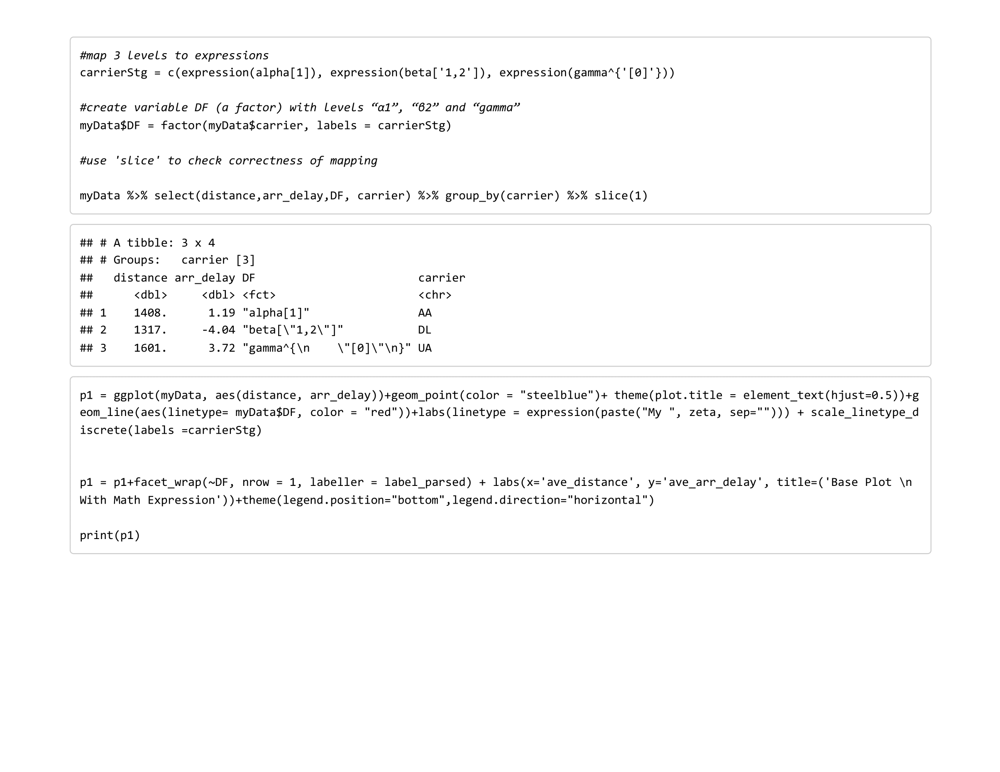
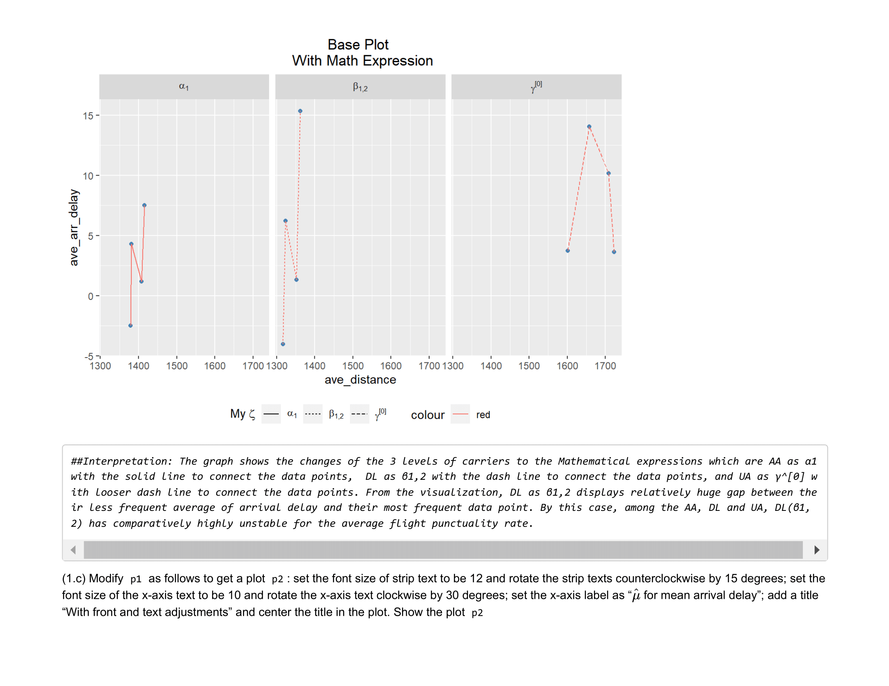
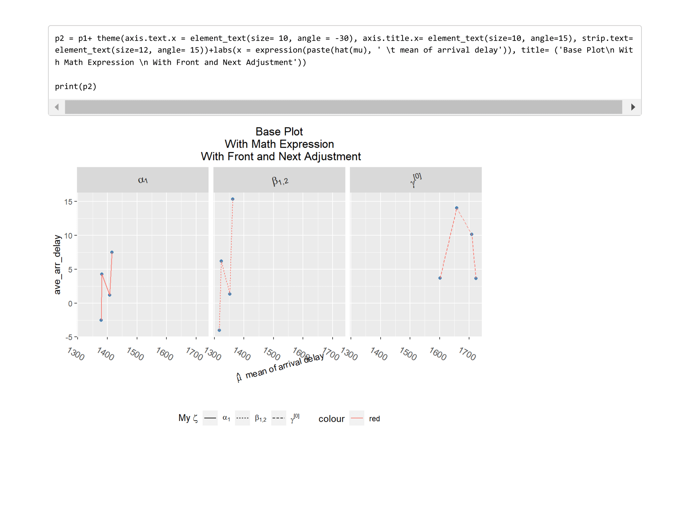
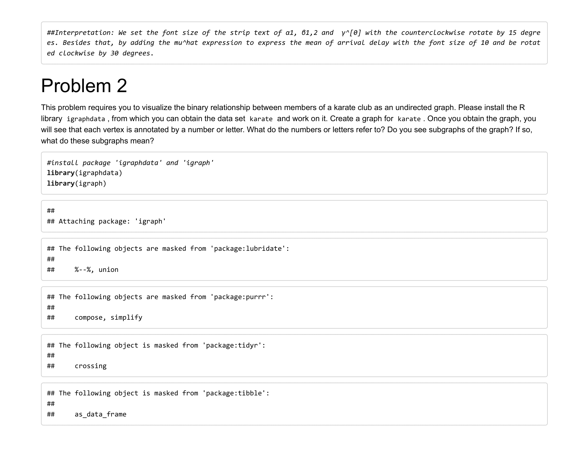
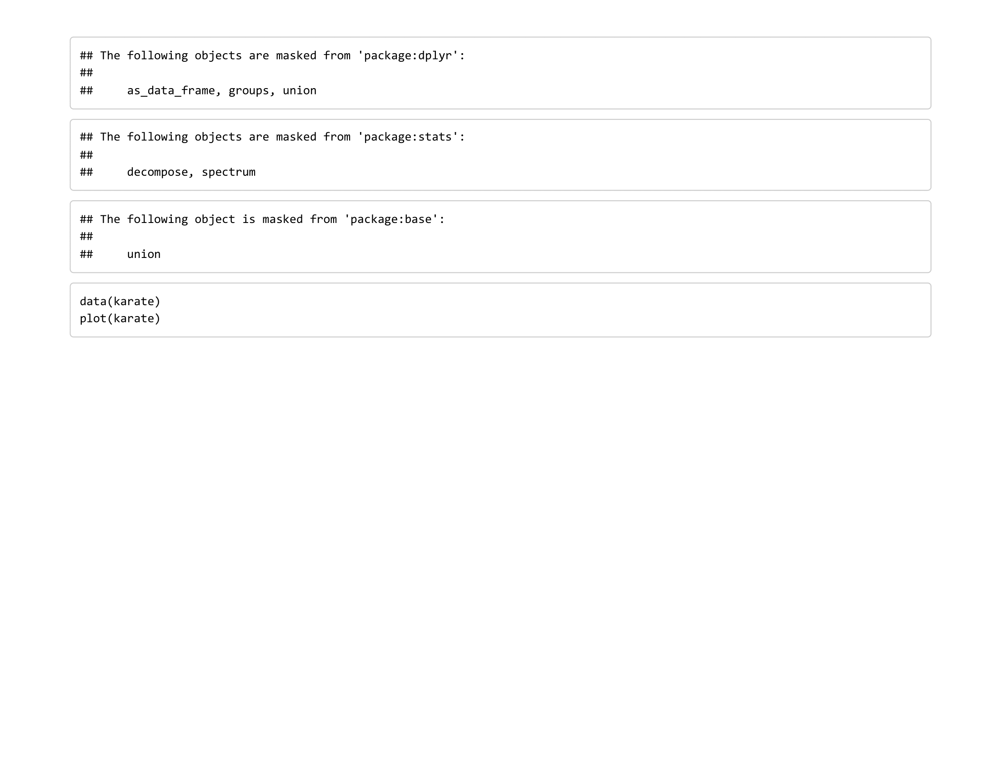
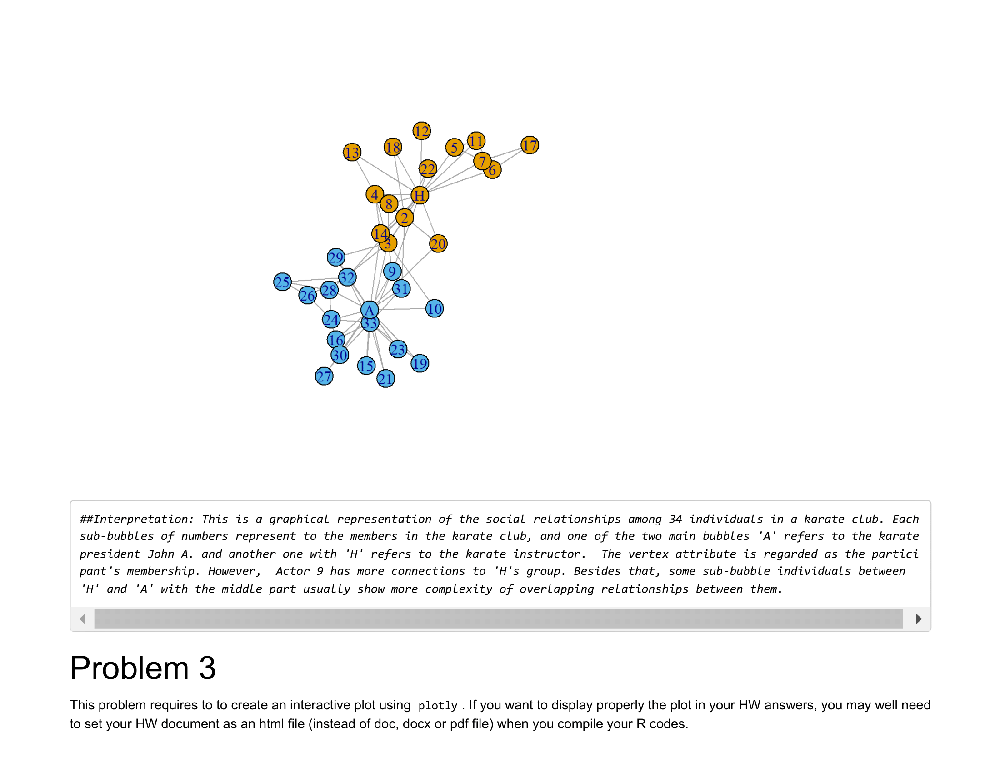
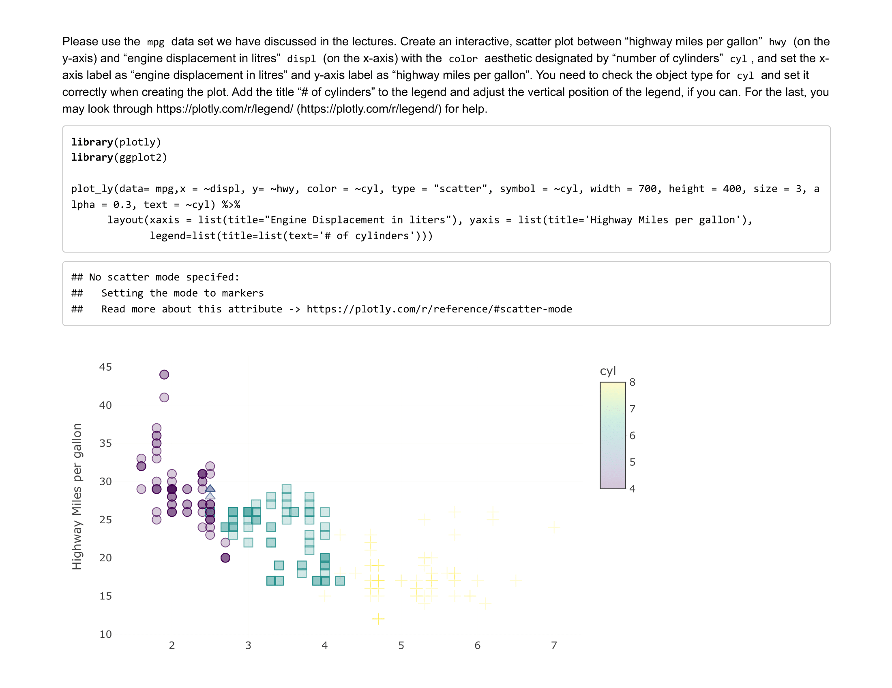
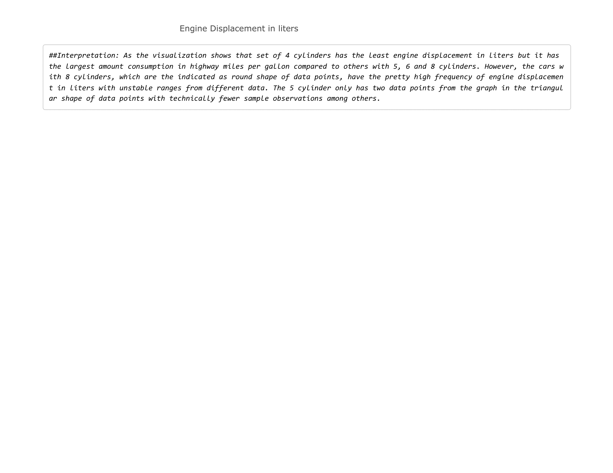
